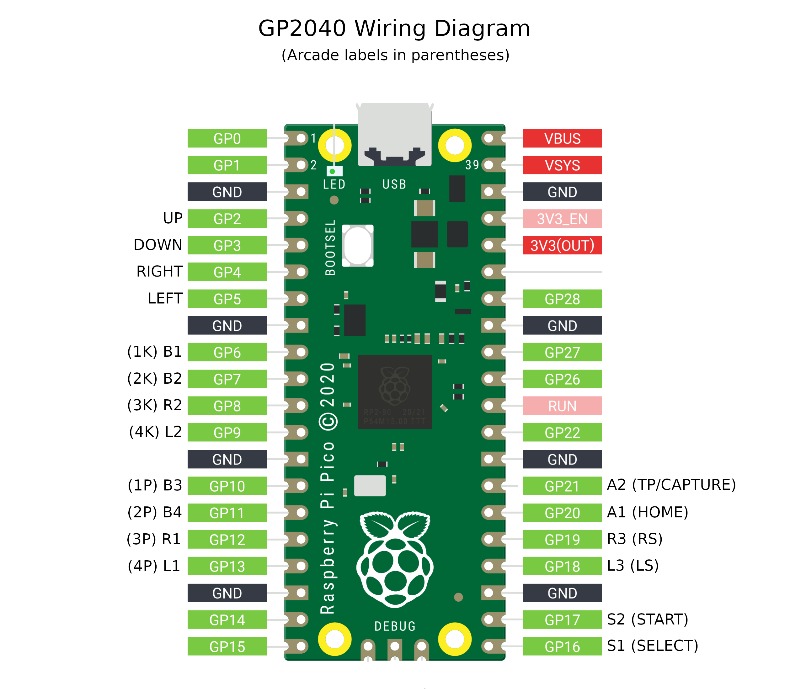

# Gamepad USB avec un Raspberry PI Pico

Cf. [GP2040](https://github.com/FeralAI/GP2040)

Cf. [Documentation](https://gp2040.info)

A priori rien à faire, tout est déjà prêt à l'emploi.

## Installation simplifiée

1) Télécharger le fichier uf2 pour RaspberryPi PICO ([Releases](https://github.com/FeralAI/GP2040/releases))

2) Débrancher le Rapsberry PI Pico

3) Maintenir le bouton BOOTSEL en le branchant à l'ordi.

4) Déposer le fichier téléchargé dans le driver RPI-RP2.

## Pinout

Liste des touches pour a PS2 pour DDR :
- B1 : Croix (PAD haut gauche)
- B2 : Rond (PAD haut droite)
- B3 : Carré (PAD bas droite)
- B4 : Triangle (PAD bas gauche)

NOTE : Toutes les touches sont en pull-up. Il faut donc les amener à la masse pour faier un appuie.

## Problèmes

Le mode SOCD nous pose problème car on ne peut pas appuier simultanément sur haut et bas ou simultanément sur droite et gauche...

Cf. [Doc](https://gp2040.info/#/usage?id=socd-modes)

A creuser où c'est dans le code et faire un custom...
En première approche, il faut aller dans le projet FeralAI/MPG et éditer le fichier "MPG/src/MPG.cpp" :
- Dans la fonction "MPG::process()" commenter a ligne "state.dpad = runSOCDCleaner(options.socdMode, state.dpad);"

Voilà voilà...
